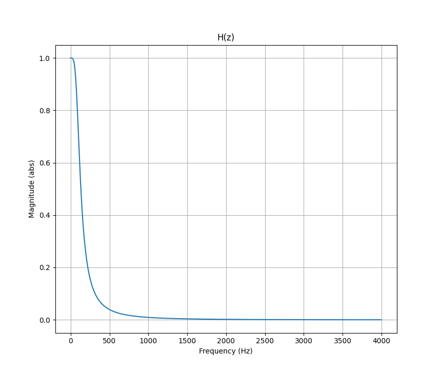
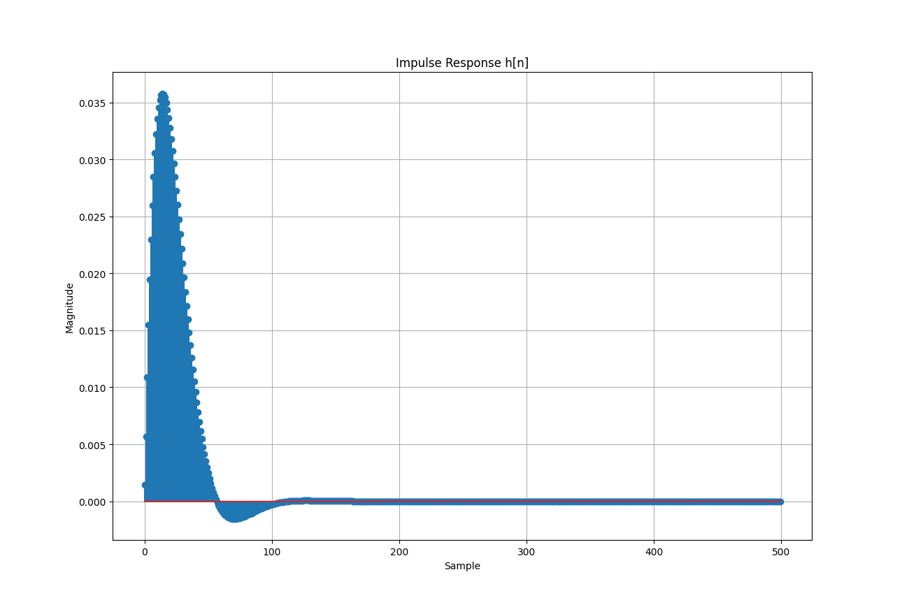
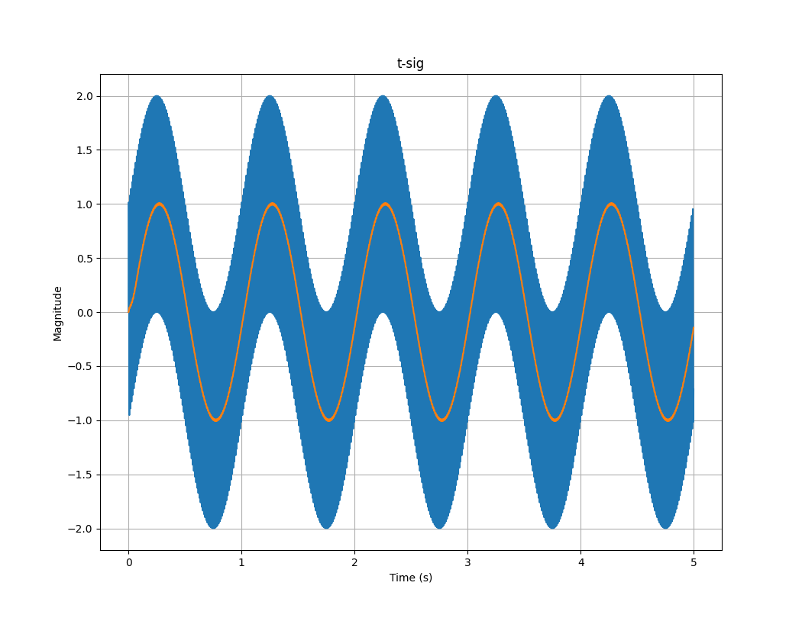

basic implmentation of DFT and working on FFT

Features basic butterworth filters and filtering options

## Setup Linux 
make sure these are installed: 

```
sudo apt install libfftw3-dev python3-dev python3-numpy
```

make build and make 
```
mkdir build
cd build
cmake ..
make
```

## Setup Win: 

download fftw3 and the libfftw3-3.dll 

you also need the to include the python <matplotlibcpp.h> and numpy core for plotting features 

## Screenshot - 2nd Order Butterworth LPF - N = 2, Fs = 8kHz, Fc = 100Hz



